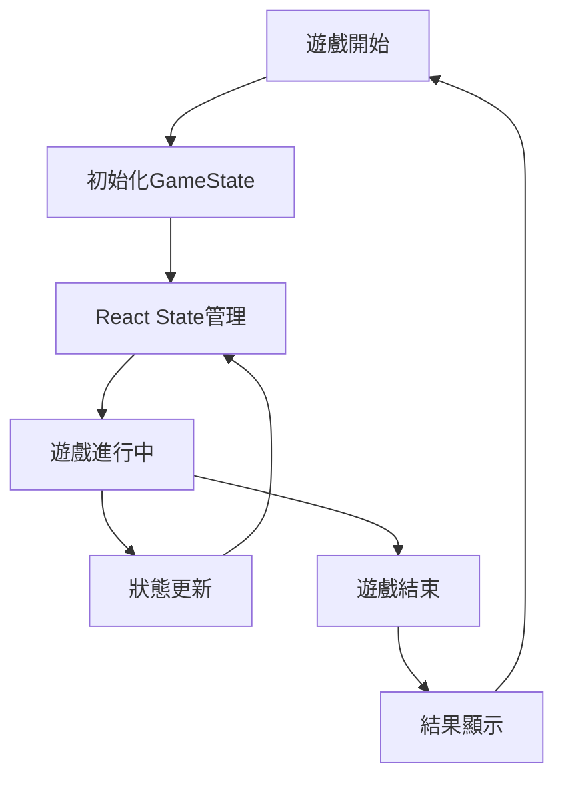
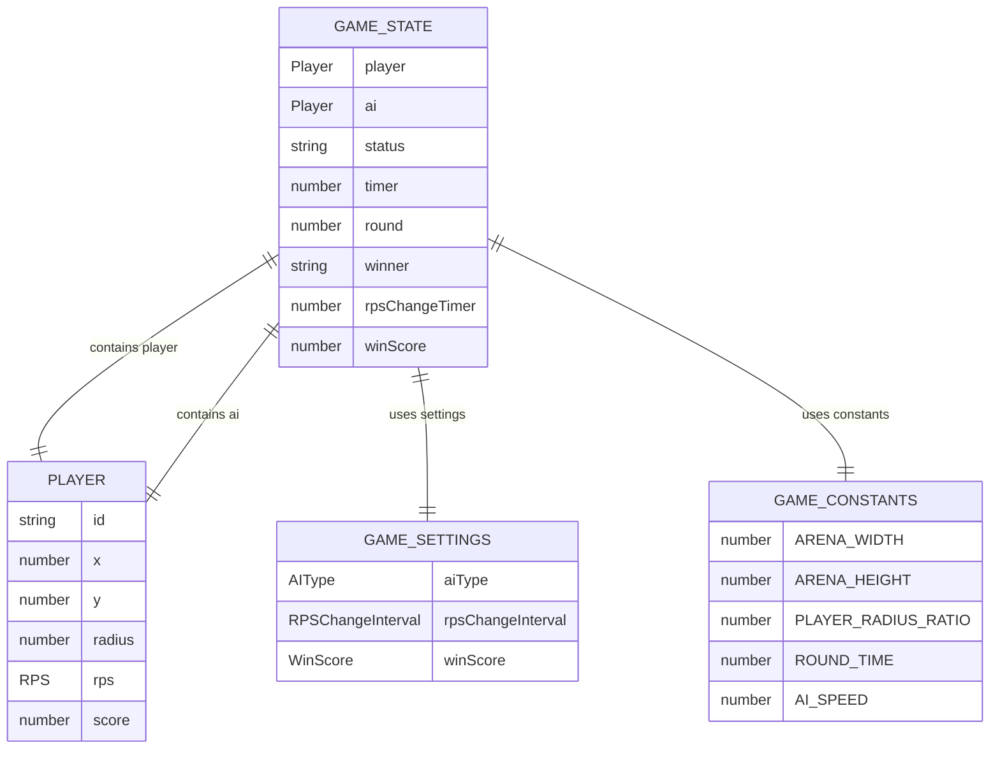

# 資料庫設計文件 v2.0 ‧ 2025-07-16

## 版本歷史
| 版本 | 日期       | 內容說明                   | 負責人 |
|------|------------|----------------------------|--------|
| 1.0  | 2025-07-15 | 首版，依API與BRD產出       | AI     |
| 2.0  | 2025-07-16 | 重構更新，基於實際實現     | AI     |

---

## 1. 資料存儲架構概述

### 1.1 存儲策略
目前遊戲採用**純本地存儲**策略，所有資料存儲於瀏覽器記憶體中，無需持久化存儲。這種設計符合遊戲的即時性和隱私性要求。

### 1.2 資料流向


---

## 2. 核心資料結構

### 2.1 TypeScript類型定義

```typescript
// 基礎類型
type RPS = 'rock' | 'paper' | 'scissors';
type AIType = 'aggressive' | 'cautious' | 'random' | 'advanced';
type RPSChangeInterval = 3 | 5 | 10;
type WinScore = 1 | 3 | 5 | 7;

// 玩家資料結構
interface Player {
  id: 'player' | 'ai';
  x: number;          // X座標
  y: number;          // Y座標
  radius: number;     // 圓形半徑
  rps: RPS;          // 當前RPS選擇
  score: number;      // 當前分數
}

// 遊戲狀態資料結構
interface GameState {
  player: Player;                          // 玩家狀態
  ai: Player;                             // AI狀態
  status: 'playing' | 'paused' | 'ended'; // 遊戲狀態
  timer: number;                          // 遊戲計時器
  round: number;                          // 當前回合
  winner?: 'player' | 'ai' | 'draw';      // 勝利者
  rpsChangeTimer: number;                 // RPS變換倒計時
  winScore: number;                       // 勝利所需分數
}

// 遊戲設定資料結構
interface GameSettings {
  aiType: AIType;                         // AI策略類型
  rpsChangeInterval: RPSChangeInterval;   // RPS變換間隔
  winScore: WinScore;                     // 勝利分數
}
```

### 2.2 資料關聯圖（ERD）



---

## 3. 資料生命週期管理

### 3.1 初始化階段
```typescript
// 初始化遊戲狀態
const initialState: GameState = {
  player: {
    id: 'player',
    x: ARENA_WIDTH * 0.25,
    y: ARENA_HEIGHT * 0.5,
    radius: Math.min(ARENA_WIDTH, ARENA_HEIGHT) * PLAYER_RADIUS_RATIO,
    rps: getRandomRPS(),
    score: 0
  },
  ai: {
    id: 'ai',
    x: ARENA_WIDTH * 0.75,
    y: ARENA_HEIGHT * 0.5,
    radius: Math.min(ARENA_WIDTH, ARENA_HEIGHT) * PLAYER_RADIUS_RATIO,
    rps: getRandomRPS(),
    score: 0
  },
  status: 'playing',
  timer: 0,
  round: 1,
  rpsChangeTimer: rpsChangeInterval * 1000,
  winScore: winScore
};
```

### 3.2 運行時更新
```typescript
// 狀態更新流程
const updateGameState = (currentState: GameState): GameState => {
  // 1. 更新玩家位置
  const updatedPlayer = updatePlayerPosition(currentState.player);
  
  // 2. 更新AI位置
  const updatedAI = updateAIPosition(currentState.ai, currentState.player);
  
  // 3. 檢查碰撞
  const collisionResult = checkCollision(updatedPlayer, updatedAI);
  
  // 4. 更新計時器
  const updatedTimer = currentState.rpsChangeTimer - 16; // 60fps
  
  // 5. 檢查RPS變換
  if (updatedTimer <= 0) {
    // 重新分配RPS
    updatedPlayer.rps = getRandomRPS();
    updatedAI.rps = getRandomRPS();
    updatedTimer = rpsChangeInterval * 1000;
  }
  
  // 6. 檢查勝利條件
  const winner = checkWinner(updatedPlayer, updatedAI, winScore);
  
  return {
    ...currentState,
    player: updatedPlayer,
    ai: updatedAI,
    timer: currentState.timer + 16,
    rpsChangeTimer: updatedTimer,
    winner: winner,
    status: winner ? 'ended' : 'playing'
  };
};
```

---

## 4. 資料一致性與驗證

### 4.1 資料驗證規則
```typescript
// 位置驗證
const validatePosition = (player: Player): boolean => {
  return player.x >= player.radius && 
         player.x <= ARENA_WIDTH - player.radius &&
         player.y >= player.radius && 
         player.y <= ARENA_HEIGHT - player.radius;
};

// RPS驗證
const validateRPS = (rps: RPS): boolean => {
  return ['rock', 'paper', 'scissors'].includes(rps);
};

// 分數驗證
const validateScore = (score: number): boolean => {
  return score >= 0 && Number.isInteger(score);
};

// 遊戲狀態驗證
const validateGameState = (state: GameState): boolean => {
  return validatePosition(state.player) &&
         validatePosition(state.ai) &&
         validateRPS(state.player.rps) &&
         validateRPS(state.ai.rps) &&
         validateScore(state.player.score) &&
         validateScore(state.ai.score);
};
```

### 4.2 錯誤處理機制
```typescript
// 狀態恢復機制
const recoverGameState = (corruptedState: GameState): GameState => {
  if (!validateGameState(corruptedState)) {
    console.warn('遊戲狀態異常，執行恢復機制');
    return createInitialState();
  }
  return corruptedState;
};

// 邊界修正
const clampPosition = (x: number, y: number, radius: number) => {
  return {
    x: Math.max(radius, Math.min(ARENA_WIDTH - radius, x)),
    y: Math.max(radius, Math.min(ARENA_HEIGHT - radius, y))
  };
};
```

---

## 5. 性能優化策略

### 5.1 記憶體管理
- **避免不必要的物件創建**：重用物件，減少垃圾回收
- **狀態不可變性**：使用immutable更新，避免意外修改
- **計算快取**：快取昂貴的計算結果

### 5.2 資料更新優化
```typescript
// 批次更新策略
const batchUpdateGameState = (updates: Partial<GameState>[]): GameState => {
  return updates.reduce((state, update) => ({
    ...state,
    ...update
  }), currentState);
};

// 選擇性更新
const updateOnlyChanged = (prevState: GameState, nextState: GameState): GameState => {
  const changes: Partial<GameState> = {};
  
  if (prevState.player.x !== nextState.player.x || 
      prevState.player.y !== nextState.player.y) {
    changes.player = nextState.player;
  }
  
  if (prevState.ai.x !== nextState.ai.x || 
      prevState.ai.y !== nextState.ai.y) {
    changes.ai = nextState.ai;
  }
  
  return Object.keys(changes).length > 0 ? 
    { ...prevState, ...changes } : prevState;
};
```

---

## 6. 未來擴展設計

### 6.1 持久化存儲（可選）
```typescript
// localStorage存儲介面
interface GameStorage {
  saveGameRecord(record: GameRecord): void;
  loadGameRecords(): GameRecord[];
  clearGameRecords(): void;
}

// 遊戲記錄資料結構
interface GameRecord {
  id: string;
  date: string;
  playerScore: number;
  aiScore: number;
  winner: 'player' | 'ai' | 'draw';
  aiType: AIType;
  winScore: WinScore;
  duration: number;
}
```

### 6.2 雲端同步（未來規劃）
```typescript
// 雲端API介面
interface CloudStorage {
  syncGameState(state: GameState): Promise<void>;
  loadGameState(): Promise<GameState>;
  saveGameRecord(record: GameRecord): Promise<void>;
  loadGameRecords(): Promise<GameRecord[]>;
}
```

---

## 7. 測試資料管理

### 7.1 測試資料生成
```typescript
// 測試用資料生成器
const createTestGameState = (overrides?: Partial<GameState>): GameState => {
  return {
    ...createInitialState(),
    ...overrides
  };
};

// 模擬遊戲進行
const simulateGameProgress = (steps: number): GameState => {
  let state = createInitialState();
  
  for (let i = 0; i < steps; i++) {
    state = updateGameState(state);
  }
  
  return state;
};
```

### 7.2 效能測試資料
```typescript
// 壓力測試資料
const createStressTestData = () => {
  const states: GameState[] = [];
  
  for (let i = 0; i < 1000; i++) {
    states.push(createTestGameState({
      timer: i * 16,
      round: Math.floor(i / 100) + 1
    }));
  }
  
  return states;
};
```

---

## 8. 資料安全性

### 8.1 資料隱私
- **本地存儲**：所有資料僅存在於瀏覽器記憶體中
- **無外部傳輸**：不向任何外部服務器傳送資料
- **無個人資料**：不收集任何用戶個人資料

### 8.2 資料完整性
- **類型檢查**：TypeScript提供編譯時類型檢查
- **執行時驗證**：關鍵資料進行執行時驗證
- **異常恢復**：資料異常時自動恢復到安全狀態

---

## 9. 監控與維護

### 9.1 資料監控
```typescript
// 資料監控Hook
const useGameStateMonitor = (state: GameState) => {
  useEffect(() => {
    if (!validateGameState(state)) {
      console.error('遊戲狀態異常:', state);
    }
    
    // 效能監控
    const memoryUsage = (performance as any).memory?.usedJSHeapSize;
    if (memoryUsage > 50 * 1024 * 1024) { // 50MB
      console.warn('記憶體使用過高:', memoryUsage);
    }
  }, [state]);
};
```

### 9.2 除錯支援
```typescript
// 開發模式除錯
const debugGameState = (state: GameState) => {
  if (process.env.NODE_ENV === 'development') {
    console.log('Game State:', {
      playerPosition: `(${state.player.x}, ${state.player.y})`,
      aiPosition: `(${state.ai.x}, ${state.ai.y})`,
      playerRPS: state.player.rps,
      aiRPS: state.ai.rps,
      scores: `${state.player.score} - ${state.ai.score}`,
      status: state.status
    });
  }
};
```

---

## 10. 追溯矩陣
- 來源API文檔：類型定義和介面設計
- 來源SRD：系統架構和技術需求
- 來源FRD：功能需求和業務邏輯
- 來源PRD：產品需求和用戶體驗
- 來源BRD：業務需求和資料需求

---

## 11. 簽署確認
| 角色         | 姓名/簽名 | 日期       |
|--------------|-----------|------------|
| 產品經理     | AI        | 2025-07-16 |
| 開發負責人   | AI        | 2025-07-16 |
| 資料架構師   | AI        | 2025-07-16 | 