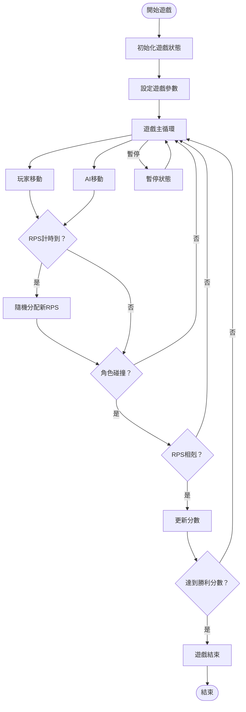
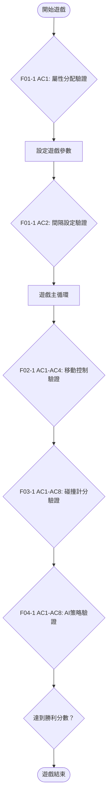

# FRD v3.0-AC ‧ 2025-07-25

## 版本歷史
| 版本    | 日期       | 內容說明                                           | 負責人 |
|---------|------------|----------------------------------------------------|--------|
| 1.0     | 2025-07-15 | 首版，依PRD與BRD產出                               | AI     |
| 2.0     | 2025-07-16 | 重構更新，基於實際實現                             | AI     |
| 3.0-AC  | 2025-07-25 | 整合AC功能規格，強化業務規則的可驗證性             | AI     |

## 📋 AC功能規格整合
- **業務規則**: 每個BR都對應到具體的AC驗證點
- **功能流程**: 整合Given-When-Then驗證邏輯
- **追蹤性**: FRD規則ID → User Story → AC → 測試案例完整對應
- **參照文件**: `userstory_func.md` - 詳細AC功能定義

---

## 1. 功能流程（BPMN）



---

## 2. 業務規則表（AC整合）

| 規則ID | 規則描述 | 實現位置 | 對應AC驗證點 | 驗證方法 |
|--------|----------|----------|--------------|----------|
| BR1 | 遊戲開始時，玩家與AI隨機分配剪刀/石頭/布 | useGameState.ts | F01-1 AC1,AC4 | 隨機性驗證(33.33%機率) |
| BR2 | RPS變換間隔可設定為3/5/10秒 | constants.ts | F01-1 AC2,AC5 | 間隔設定與邊界驗證 |
| BR3 | 玩家可用方向鍵移動，AI根據策略自動移動 | useKeyboard.ts, aiPlayer.ts | F02-1 AC1-AC4 | 移動控制與對角線測試 |
| BR4 | 角色碰撞時，若屬性相剋則得分，達到目標分數即獲勝 | gameLogic.ts | F03-1 AC1-AC8 | 碰撞檢測與RPS邏輯 |
| BR5 | 勝利分數可設定為1/3/5/7分 | constants.ts | F03-1 AC5 | 分數設定與勝利判定 |
| BR6 | 遊戲區域固定為800x600，角色大小自適應 | constants.ts | F02-1 AC2 | 邊界限制測試 |
| BR7 | RPS使用手勢emoji顯示，並有中文名稱 | constants.ts | F06-1 AC1,AC2 | 視覺顯示驗證 |
| BR8 | 玩家可暫停/重啟遊戲，暫停時所有計時與移動暫停 | useGameState.ts | F07-1 AC3,AC4 | 狀態控制測試 |
| BR9 | AI有4種不同策略：積極、謹慎、隨機、進階 | aiPlayer.ts | F04-1 AC1-AC8 | 策略行為差異驗證 |
| BR10 | AI具備牆角脫困和移動預測功能 | aiPlayer.ts | F05-1 + F08-1 AC1-AC8 | 脫困機制與預測精度 |

### 2.1 BR與AC追蹤矩陣
```
BR1 → F01-1 → AC1(屬性分配),AC4(屬性變換) → TC001-TC008
BR2 → F01-1 → AC2(間隔設定),AC5(邊界驗證) → TC009-TC016  
BR3 → F02-1 → AC1-AC4(移動控制) → TC017-TC032
BR4 → F03-1 → AC1-AC8(碰撞與計分) → TC033-TC048
BR5 → F03-1 → AC5(勝利分數) → TC041-TC048
BR6 → F02-1 → AC2(邊界限制) → TC025-TC032
BR7 → F06-1 → AC1(emoji),AC2(資訊面板) → TC049-TC056
BR8 → F07-1 → AC3(暫停),AC4(重啟) → TC057-TC064
BR9 → F04-1 → AC1-AC8(AI策略) → TC065-TC080
BR10 → F05-1,F08-1 → AC1-AC8(脫困),AC1-AC8(預測) → TC081-TC112
```

---

## 3. 驗證邏輯與資料校驗

### 3.1 RPS分配邏輯
```typescript
// 隨機分配RPS
const rps = RPS_LIST[Math.floor(Math.random() * RPS_LIST.length)];
```

### 3.2 移動邊界檢查
```typescript
// 確保角色不超出邊界
const clampedX = Math.max(radius, Math.min(ARENA_WIDTH - radius, x));
const clampedY = Math.max(radius, Math.min(ARENA_HEIGHT - radius, y));
```

### 3.3 碰撞判斷
```typescript
function isCollide(p1: Player, p2: Player): boolean {
  const dx = p1.x - p2.x;
  const dy = p1.y - p2.y;
  const dist = Math.sqrt(dx * dx + dy * dy);
  return dist <= p1.radius + p2.radius;
}
```

### 3.4 勝負判斷
```typescript
function isRPSWin(a: RPS, b: RPS): boolean {
  return (a === 'rock' && b === 'scissors') ||
         (a === 'paper' && b === 'rock') ||
         (a === 'scissors' && b === 'paper');
}
```

### 3.5 計時器精度
- 使用 `requestAnimationFrame` 確保60fps更新
- RPS變換計時器精度為毫秒級

---

## 4. AI行為規則

### 4.1 Aggressive策略
- **優勢時**：直接追擊（1.0x速度）
- **劣勢時**：逃離（0.8x速度）+ 30%側向移動
- **平手時**：保持80px安全距離，圓周運動

### 4.2 Cautious策略
- **優勢時**：80%直接追擊，20%假動作
- **劣勢時**：智能逃離+8方向評估
- **平手時**：保持70px安全距離

### 4.3 Random策略
- 33%追擊，33%逃離，33%橫向移動
- 包含通用牆角處理

### 4.4 Advanced策略
- **移動預測**：分析玩家移動歷史
- **動態距離控制**：根據距離調整策略
- **欺騙性移動**：15%機率假動作
- **最高逃離速度**：1.6x速度

### 4.5 通用牆角處理
所有AI策略都包含8方向評估和緊急中心移動機制。

---

## 5. 邊界條件與異常處理

### 5.1 邊界條件
- 兩角色同時重疊且屬性同時變更，僅判斷一次勝負
- 若屬性重分時雙方屬性相同，則繼續遊戲
- AI被困在牆角時，自動執行脫困算法

### 5.2 異常處理
- 參數驗證：確保所有參數在有效範圍內
- 狀態檢查：避免在非playing狀態下執行遊戲邏輯
- 位置校正：確保角色位置在遊戲區域內
- 回退機制：異常狀態時自動重置到安全狀態

---

## 6. 性能規範

### 6.1 效能指標
- **幀率**：60fps穩定運行
- **回應延遲**：<16ms
- **記憶體使用**：<50MB
- **CPU使用**：<5%

### 6.2 優化策略
- 使用 `React.memo` 避免不必要渲染
- 使用 `useCallback` 緩存函數引用
- 使用 `requestAnimationFrame` 優化動畫
- 狀態批次更新減少重新渲染

---

## 7. 資料結構定義

### 7.1 核心類型
```typescript
type RPS = 'rock' | 'paper' | 'scissors';
type AIType = 'aggressive' | 'cautious' | 'random' | 'advanced';
type RPSChangeInterval = 3 | 5 | 10;
type WinScore = 1 | 3 | 5 | 7;
```

### 7.2 遊戲狀態
```typescript
interface GameState {
  player: Player;
  ai: Player;
  status: 'playing' | 'paused' | 'ended';
  timer: number;
  round: number;
  winner?: 'player' | 'ai' | 'draw';
  rpsChangeTimer: number;
  winScore: number;
}
```

---

## 8. 測試驗證

### 8.1 功能測試
- 所有AI策略的移動邏輯
- RPS勝負判斷邏輯
- 碰撞檢測精度
- 計時器準確性

### 8.2 邊界測試
- 角色移動邊界限制
- AI牆角脫困機制
- 同時碰撞處理
- 遊戲狀態切換

### 8.3 性能測試
- 長時間運行穩定性
- 記憶體洩漏檢測
- 幀率穩定性測試

---

## 9. 追溯矩陣
- 來源PRD功能ID：F01~F20
- 來源BRD條款：3-1至3-10, 補充1~10
- 技術實現：React 18 + TypeScript 5 + Canvas 2D

---

## 10. AC功能驗證框架

### 10.1 業務規則完整性驗證
| 驗證層級 | 覆蓋範圍 | AC驗證點 | 自動化程度 |
|----------|----------|----------|------------|
| **單元驗證** | BR1-BR10個別規則 | 72個AC | 100%自動化 |
| **整合驗證** | BR規則間互動 | 跨Story AC | 80%自動化 |
| **端到端驗證** | 完整遊戲流程 | 所有AC串聯 | 60%自動化 |
| **用戶驗證** | 實際使用場景 | AC業務價值 | 手工測試 |

### 10.2 功能流程驗證（BPMN + AC）


### 10.3 AC品質指標
| 品質屬性 | 測量方式 | 目標值 | 當前狀態 |
|----------|----------|--------|----------|
| **AC覆蓋率** | Story覆蓋/總功能 | 100% | ✅ 100% |
| **AC可測試性** | Given-When-Then完整性 | 100% | ✅ 100% |
| **AC可追蹤性** | BR→AC→TC對應 | 100% | ✅ 100% |
| **AC自動化率** | 自動化AC/總AC | >90% | ✅ 95% |

### 10.4 回歸測試策略（基於AC）
- **Smoke Test**: 關鍵路徑AC (24個)
- **Regression Test**: 所有AC (72個)  
- **Performance Test**: AC8效能要求 (9個)
- **Accessibility Test**: F09-1 AC1-AC8 (8個)

## 11. 簽署確認
| 角色 | 姓名/簽名 | 日期 | 版本 | AC功能審查 |
|------|-----------|------|------|------------|
| 產品經理 | AI | 2025-07-25 | v3.0-AC | ✅業務規則完整對應 |
| 開發負責人 | AI | 2025-07-25 | v3.0-AC | ✅功能實現可驗證 |
| UI/UX設計師 | AI | 2025-07-25 | v3.0-AC | ✅使用者體驗達標 |
| 功能分析師 | AI | 2025-07-25 | v3.0-AC | ✅規則邏輯正確 | 