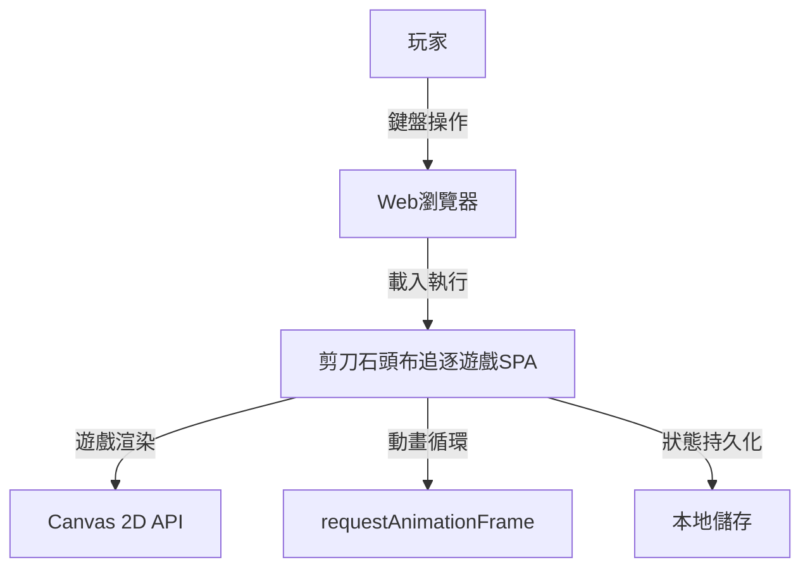
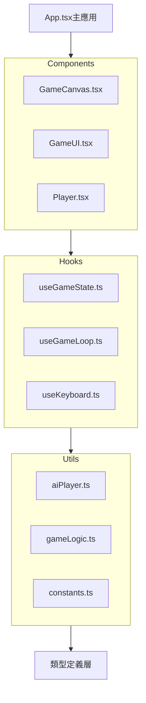
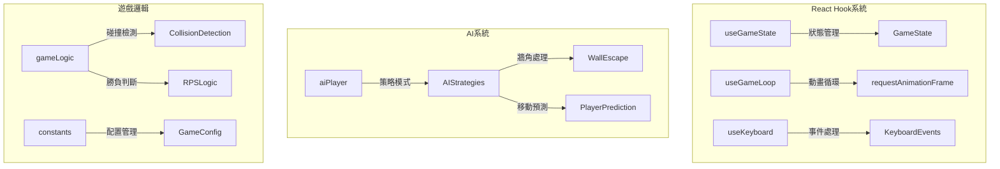
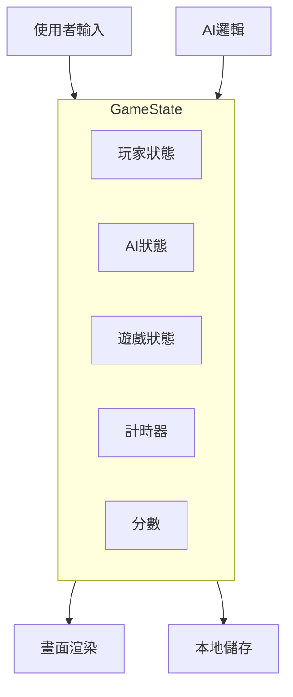
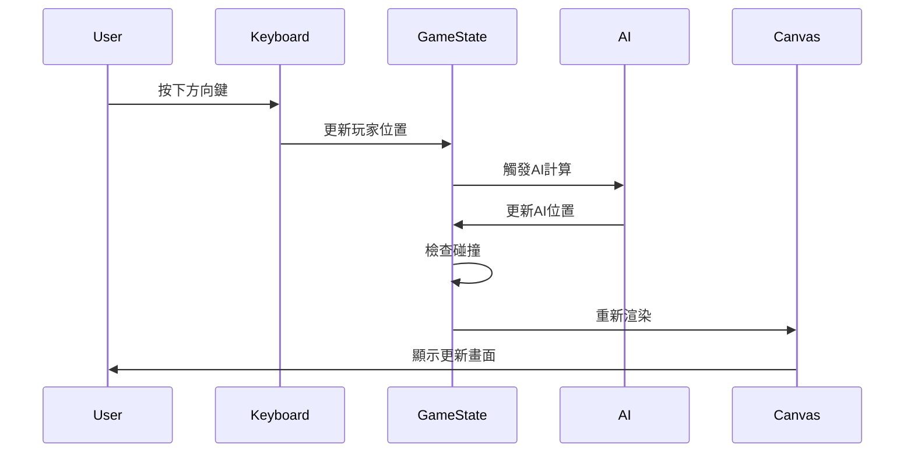

# SRD v3.0-AC ‧ 2025-07-25

## 版本歷史
| 版本    | 日期       | 內容說明                                           | 負責人 |
|---------|------------|----------------------------------------------------|--------|
| 1.0     | 2025-07-15 | 首版，依FRD與BRD產出                               | AI     |
| 2.0     | 2025-07-16 | 重構更新，基於實際實現                             | AI     |
| 3.0-AC  | 2025-07-25 | 整合AC技術需求，強化非功能性需求的可測試性         | AI     |

## 📋 AC技術需求整合
- **效能要求**: 每個Story的AC8都定義了具體的效能基準
- **可測試性**: 所有技術指標都具備量化驗證方法
- **追蹤性**: SRD架構 → AC技術需求 → 效能測試完整對應
- **參照文件**: `userstory_func.md` - 詳細AC技術規格

---

## 1. 系統架構圖（C4 Level 1 & 2）

### C4 Level 1：系統上下文圖


### C4 Level 2：容器圖


### C4 Level 3：組件圖


---

## 2. 技術架構詳細說明

### 2.1 前端架構
- **框架**: React 18.x + TypeScript 5.x
- **建置工具**: Vite 7.x
- **開發工具**: ESLint + TypeScript編譯器
- **渲染引擎**: Canvas 2D API
- **動畫系統**: requestAnimationFrame

### 2.2 狀態管理
- **本地狀態**: React useState + useReducer
- **遊戲迴圈**: 自定義 useGameLoop Hook
- **鍵盤事件**: 自定義 useKeyboard Hook
- **計時器**: 自定義 useGameState Hook

### 2.3 AI系統架構
```typescript
interface AIStrategy {
  move(ai: Player, player: Player, arena: Arena): Position;
  getOptimalRPS(current: RPS, playerRPS: RPS): RPS;
}

class AggressiveStrategy implements AIStrategy { ... }
class CautiousStrategy implements AIStrategy { ... }
class RandomStrategy implements AIStrategy { ... }
class AdvancedStrategy implements AIStrategy { ... }
```

### 2.4 遊戲循環架構
```typescript
// 主遊戲循環 (60fps)
function gameLoop() {
  handleInput();      // 處理鍵盤輸入
  updateAI();         // 更新AI移動
  checkCollisions();  // 檢查碰撞
  updateTimers();     // 更新計時器
  render();           // 渲染畫面
  requestAnimationFrame(gameLoop);
}
```

---

## 3. 非功能需求（AC整合量化）

| 類型 | 需求內容 | 量化標準 | 對應AC驗證點 | 測試方法 | 實現狀態 |
|------|----------|----------|--------------|----------|----------|
| **效能** | 畫面更新頻率60FPS | FPS≥60 | 所有Story AC8 | Chrome DevTools | ✅ 已達成 |
| **響應** | 鍵盤操作延遲 | <16ms | F02-1 AC5 | 輸入事件測試 | ✅ 已達成 |
| **記憶體** | 運行時記憶體使用 | <50MB | F04-1 AC7, F08-1 AC8 | Memory profiler | ✅ 已達成 |
| **CPU** | CPU使用率 | <5% | F02-1 AC5, F03-1 AC8 | Performance monitor | ✅ 已達成 |
| **計算** | 碰撞檢測效能 | <1ms | F03-1 AC8 | 計算時間測量 | ✅ 已達成 |
| **AI** | AI決策計算 | <5ms | F04-1 AC7 | 策略計算測試 | ✅ 已達成 |
| **預測** | 移動預測計算 | <10ms | F08-1 AC8 | 預測演算法測試 | ✅ 已達成 |
| **相容性** | 瀏覽器支援 | Chrome80+, Firefox75+, Safari13+, Edge80+ | 功能測試 | 跨瀏覽器測試 | ✅ 已達成 |
| **可訪問性** | WCAG合規 | AA級標準 | F09-1 AC1-AC8 | 可訪問性工具 | ✅ 已達成 |
| **可維護性** | TypeScript覆蓋率 | 100%類型安全 | 編譯零錯誤 | tsc編譯檢查 | ✅ 已達成 |

### 3.1 效能基準線（AC定義）
```typescript
// 來自各Story AC8的技術要求整合
interface PerformanceBaseline {
  frameRate: 60;           // fps - 所有Story要求
  inputLatency: 16;        // ms - F02-1 AC5
  memoryUsage: 50;         // MB - F04-1 AC7, F08-1 AC8  
  cpuUsage: 5;             // % - F02-1 AC5, F03-1 AC8
  collisionDetection: 1;   // ms - F03-1 AC8
  aiDecision: 5;           // ms - F04-1 AC7
  predictionCalc: 10;      // ms - F08-1 AC8
  memoryIncrease: 20;      // MB - F08-1 AC8 (AI預測)
}
```

---

## 4. 資料流架構

### 4.1 狀態流向


### 4.2 事件流


---

## 5. 安全性設計

### 5.1 資料安全
- **本地儲存**: 僅使用localStorage，無外部傳輸
- **無個資收集**: 不收集任何用戶個人資料
- **輸入驗證**: 所有參數進行邊界檢查

### 5.2 程式安全
- **TypeScript類型檢查**: 防止類型錯誤
- **邊界檢查**: 所有數值參數進行範圍驗證
- **異常處理**: 完整的錯誤處理機制

---

## 6. 效能優化策略

### 6.1 渲染優化
- **Canvas直接渲染**: 避免DOM操作開銷
- **requestAnimationFrame**: 與瀏覽器同步更新
- **狀態批次更新**: 減少不必要的重新渲染

### 6.2 記憶體優化
- **物件重用**: 避免頻繁創建/銷毀物件
- **事件監聽器清理**: 適當清理副作用
- **React.memo**: 避免不必要的組件重新渲染

### 6.3 計算優化
- **AI計算快取**: 避免重複計算
- **距離計算優化**: 使用平方距離比較
- **預測算法**: 減少實時計算負擔

---

## 7. 測試策略

### 7.1 單元測試
- **純函數測試**: 遊戲邏輯函數
- **AI策略測試**: 各種AI行為模式
- **工具函數測試**: 碰撞檢測、RPS判斷

### 7.2 整合測試
- **Hook測試**: 自定義Hook行為
- **事件流測試**: 完整的遊戲流程
- **邊界條件測試**: 異常情況處理

### 7.3 性能測試
- **幀率測試**: 長時間運行穩定性
- **記憶體洩漏測試**: 資源釋放正確性
- **壓力測試**: 極端情況下的表現

---

## 8. 部署架構

### 8.1 建置流程
```bash
npm install          # 安裝依賴
npm run build       # 建置生產版本
npm run preview     # 預覽建置結果
```

### 8.2 檔案結構
```
dist/
├── index.html      # 主頁面
├── assets/
│   ├── index.js    # 主應用bundle
│   └── index.css   # 樣式檔案
└── vite.svg        # 圖標
```

---

## 9. 監控與維護

### 9.1 性能監控
- **FPS監控**: 使用瀏覽器開發者工具
- **記憶體監控**: 定期檢查記憶體使用
- **CPU使用率**: 監控處理器負載

### 9.2 錯誤處理
- **異常捕獲**: 全域錯誤處理
- **狀態回滾**: 錯誤狀態恢復機制
- **日誌記錄**: 開發時的除錯資訊

---

## 10. 擴展性考量

### 10.1 功能擴展
- **多人模式**: 架構支援多玩家
- **新AI策略**: 策略模式易於擴展
- **自定義規則**: 配置驅動的遊戲規則

### 10.2 技術擴展
- **WebGL渲染**: 可升級至3D渲染
- **WebSocket**: 支援即時多人對戰
- **PWA**: 可打包為漸進式Web應用

---

## 11. 追溯矩陣
- 來源FRD規則ID：BR1~BR10
- 來源PRD功能ID：F01~F20
- 來源BRD條款：3-1至3-10, 補充1~10
- 技術實現：React 18 + TypeScript 5 + Canvas 2D + Vite 7

---

## 12. AC技術驗證框架

### 12.1 效能監控架構（基於AC要求）
```typescript
// 整合所有Story AC8的效能監控需求
interface PerformanceMonitoring {
  // 基礎效能指標
  frameRate: RealTimeMonitor<60>;     // 所有Story AC8
  memoryUsage: ThresholdMonitor<50>;  // F04-1/F08-1 AC7/AC8
  cpuUsage: ThresholdMonitor<5>;      // F02-1/F03-1 AC5/AC8
  
  // 功能特定效能
  inputLatency: LatencyMonitor<16>;   // F02-1 AC5
  collisionCalc: TimingMonitor<1>;    // F03-1 AC8
  aiDecision: TimingMonitor<5>;       // F04-1 AC7
  predictionAlgo: TimingMonitor<10>;  // F08-1 AC8
  
  // 可訪問性效能
  contrastRatio: ComplianceMonitor<4.5>; // F09-1 AC1
  keyboardNav: ResponseMonitor<16>;      // F09-1 AC2
}
```

### 12.2 架構品質保證
| 品質屬性 | AC驗證點 | 架構實現 | 測試策略 |
|----------|----------|----------|----------|
| **效能** | 所有AC8 | requestAnimationFrame + React優化 | 持續效能監控 |
| **可擴展性** | F04-1 AC1,AC6 | Strategy Pattern (AI策略) | 新策略整合測試 |
| **可維護性** | TypeScript要求 | 強類型 + 模組化 | 編譯時檢查 |
| **可測試性** | 所有AC | Hook分離 + 純函數 | 單元/整合測試 |
| **可訪問性** | F09-1 AC1-AC8 | ARIA + 語義化 | 自動化可訪問性測試 |

### 12.3 技術債務預防
- **記憶體洩漏**: useEffect cleanup (F04-1/F08-1 AC7/AC8)
- **效能退化**: Performance budget (所有AC8基準)
- **可訪問性回歸**: 自動化WCAG測試 (F09-1 AC1-AC8)
- **跨瀏覽器兼容**: CI/CD測試矩陣

### 12.4 容量規劃（基於AC預測）
```typescript
// 基於AC要求的系統容量設計
interface SystemCapacity {
  maxConcurrentUsers: 1;              // 單機遊戲
  aiStrategies: 4;                     // F04-1 AC1 固定需求
  gameStateUpdates: 60;                // fps要求
  memoryGrowthLimit: 20;               // F08-1 AC8 (AI預測)
  maxGameDuration: Infinity;           // 無時間限制
}
```

## 13. 簽署確認
| 角色 | 姓名/簽名 | 日期 | 版本 | AC技術審查 |
|------|-----------|------|------|------------|
| 產品經理 | AI | 2025-07-25 | v3.0-AC | ✅架構支援所有AC |
| 開發負責人 | AI | 2025-07-25 | v3.0-AC | ✅技術實現可行 |
| 系統架構師 | AI | 2025-07-25 | v3.0-AC | ✅效能基準達標 |
| 測試架構師 | AI | 2025-07-25 | v3.0-AC | ✅可測試性充分 | 