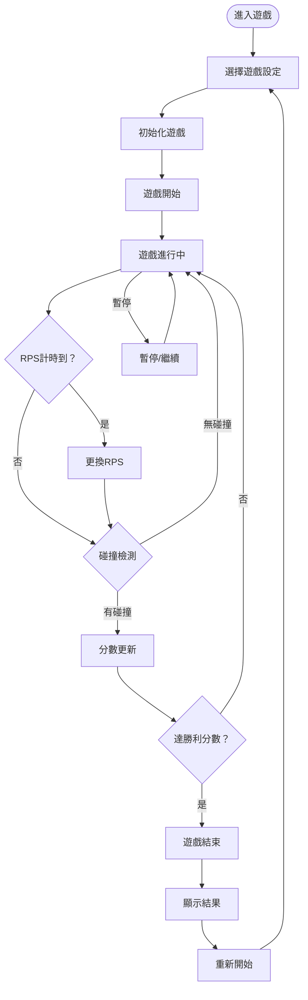
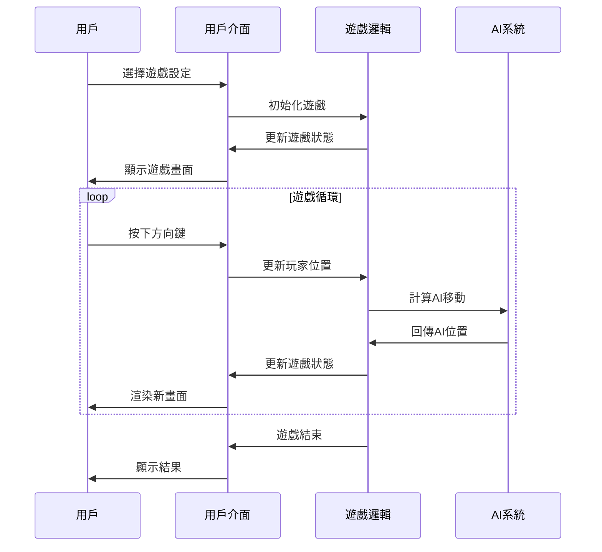

# UI／UX設計說明文件 v2.0 ‧ 2025-07-16

## 版本歷史
| 版本 | 日期       | 內容說明                   | 負責人 |
|------|------------|----------------------------|--------|
| 1.0  | 2025-07-15 | 首版，依SRD與BRD產出       | AI     |
| 2.0  | 2025-07-16 | 重構更新，基於實際實現     | AI     |

---

## 1. 設計理念

### 1.1 設計原則
- **直覺性**：遊戲規則一目了然，無學習成本
- **反應性**：即時視覺反饋，60fps流暢體驗
- **一致性**：統一的視覺語言和交互模式
- **可訪問性**：支援多種用戶需求，包括可訪問性設計

### 1.2 目標用戶
- 🎮 **休閒玩家**：尋求簡單有趣的遊戲體驗
- 🎓 **學生群體**：課堂互動和反應訓練
- 🏆 **挑戰者**：追求高難度AI對戰
- ♿ **特殊需求用戶**：需要可訪問性支援

---

## 2. 使用者流程圖

### 2.1 完整用戶旅程


### 2.2 用戶互動流程


---

## 3. 介面設計

### 3.1 整體佈局
```
┌─────────────────────────────────────────────────┐
│                遊戲設定面板                      │
│ AI策略: [▼] RPS間隔: [▼] 勝利分數: [▼]          │
├─────────────────────────────────────────────────┤
│  玩家資訊    │        遊戲區域        │  AI資訊   │
│  👤 玩家     │    ┌─────────────────┐   │  🤖 AI    │
│  分數: 2     │    │                 │   │  分數: 1  │
│  ✊ 石頭     │    │   ●           ●  │   │  ✌️ 剪刀 │
│             │    │  玩家        AI   │   │          │
│             │    │                 │   │          │
│             │    │                 │   │          │
│             │    └─────────────────┘   │          │
├─────────────────────────────────────────────────┤
│   狀態: 遊戲中  │  RPS計時: 4秒  │  ⏸️ 暫停 🔄 重啟│
└─────────────────────────────────────────────────┘
```

### 3.2 響應式設計
- **桌面版**：1200px+ 完整橫向佈局
- **平板版**：768px-1199px 適中佈局，設定面板收摺
- **手機版**：<768px 垂直佈局，簡化介面

---

## 4. 視覺設計系統

### 4.1 色彩系統
```css
/* 主題色彩 */
:root {
  /* 玩家主題色 */
  --player-primary: #2196F3;      /* 藍色 */
  --player-secondary: #E3F2FD;    /* 淺藍色 */
  --player-border: #1976D2;       /* 深藍色 */
  
  /* AI主題色 */
  --ai-primary: #9C27B0;          /* 紫色 */
  --ai-secondary: #F3E5F5;        /* 淺紫色 */
  --ai-border: #7B1FA2;           /* 深紫色 */
  
  /* 功能色彩 */
  --success: #4CAF50;             /* 綠色 */
  --warning: #FF9800;             /* 橙色 */
  --error: #F44336;               /* 紅色 */
  --info: #2196F3;                /* 藍色 */
  
  /* 中性色彩 */
  --background: #FAFAFA;          /* 背景色 */
  --surface: #FFFFFF;             /* 表面色 */
  --text-primary: #212121;        /* 主文字 */
  --text-secondary: #757575;      /* 次文字 */
  --border: #E0E0E0;             /* 邊框 */
}
```

### 4.2 字體系統
```css
/* 字體階層 */
.text-h1 { font-size: 2.5rem; font-weight: 700; }    /* 主標題 */
.text-h2 { font-size: 2rem; font-weight: 600; }      /* 次標題 */
.text-h3 { font-size: 1.5rem; font-weight: 600; }    /* 小標題 */
.text-body { font-size: 1rem; font-weight: 400; }    /* 內文 */
.text-caption { font-size: 0.875rem; font-weight: 400; } /* 說明文字 */

/* 特殊字體 */
.text-emoji { font-size: 2rem; line-height: 1; }     /* Emoji顯示 */
.text-score { font-size: 1.25rem; font-weight: 700; } /* 分數顯示 */
.text-timer { font-size: 1.125rem; font-weight: 600; } /* 計時器 */
```

### 4.3 間距系統
```css
/* 間距階層 */
.spacing-xs { margin/padding: 0.25rem; }    /* 4px */
.spacing-sm { margin/padding: 0.5rem; }     /* 8px */
.spacing-md { margin/padding: 1rem; }       /* 16px */
.spacing-lg { margin/padding: 1.5rem; }     /* 24px */
.spacing-xl { margin/padding: 2rem; }       /* 32px */
```

---

## 5. 組件設計

### 5.1 遊戲畫布 (GameCanvas)
```typescript
interface GameCanvasProps {
  player: Player;
  ai: Player;
  width: number;
  height: number;
}

// 視覺特性
- 尺寸: 800x600px (固定)
- 背景: 淺灰色 (#F5F5F5)
- 邊框: 2px 實線 (#E0E0E0)
- 玩家圓圈: 藍色主題
- AI圓圈: 紫色主題
- RPS emoji: 居中顯示，大小自適應
```

### 5.2 玩家資訊 (PlayerInfo)
```typescript
interface PlayerInfoProps {
  player: Player;
  theme: 'player' | 'ai';
}

// 視覺特性
- 背景: 主題色淺色版本
- 邊框: 2px 主題色
- 圓角: 8px
- 內邊距: 12px 16px
- 字體: 粗體顯示
- Emoji: 28px 大小
```

### 5.3 遊戲設定面板 (GameSettings)
```typescript
interface GameSettingsProps {
  aiType: AIType;
  rpsInterval: RPSChangeInterval;
  winScore: WinScore;
  onSettingsChange: (settings: GameSettings) => void;
}

// 視覺特性
- 背景: 白色
- 邊框: 1px 灰色
- 圓角: 4px
- 下拉選單: 統一樣式
- 間距: 16px
```

### 5.4 控制按鈕 (GameControls)
```typescript
interface GameControlsProps {
  status: GameStatus;
  onPause: () => void;
  onRestart: () => void;
}

// 視覺特性
- 按鈕高度: 40px
- 圓角: 4px
- 字體: 16px 粗體
- 間距: 8px
- 懸停效果: 顏色變深
```

---

## 6. 互動設計

### 6.1 鍵盤操作
```typescript
// 主要操作
const keyboardMappings = {
  ArrowUp: '向上移動',
  ArrowDown: '向下移動',
  ArrowLeft: '向左移動',
  ArrowRight: '向右移動',
  Space: '暫停/繼續',
  Enter: '重新開始',
  Escape: '設定選單'
};
```

### 6.2 視覺反饋
```css
/* 按鈕互動狀態 */
.button {
  transition: all 0.2s ease;
}

.button:hover {
  transform: translateY(-2px);
  box-shadow: 0 4px 8px rgba(0,0,0,0.2);
}

.button:active {
  transform: translateY(0);
  box-shadow: 0 2px 4px rgba(0,0,0,0.2);
}

/* 遊戲狀態指示 */
.game-status {
  transition: color 0.3s ease;
}

.game-status.playing { color: var(--success); }
.game-status.paused { color: var(--warning); }
.game-status.ended { color: var(--error); }
```

### 6.3 動畫效果
```css
/* RPS變換動畫 */
@keyframes rpsChange {
  0% { transform: scale(1); }
  50% { transform: scale(1.2); }
  100% { transform: scale(1); }
}

.rps-changing {
  animation: rpsChange 0.5s ease-in-out;
}

/* 碰撞效果 */
@keyframes collision {
  0% { transform: scale(1); }
  25% { transform: scale(1.1); }
  50% { transform: scale(0.9); }
  75% { transform: scale(1.05); }
  100% { transform: scale(1); }
}

.collision-effect {
  animation: collision 0.3s ease-in-out;
}
```

---

## 7. 可訪問性設計

### 7.1 色彩對比
```css
/* WCAG AA 標準對比度 */
.text-on-light {
  color: #212121; /* 對比度 8.9:1 */
}

.text-on-dark {
  color: #FFFFFF; /* 對比度 21:1 */
}

.text-secondary {
  color: #757575; /* 對比度 4.6:1 */
}
```

### 7.2 鍵盤導航
```css
/* 焦點指示器 */
.focusable:focus {
  outline: 2px solid var(--info);
  outline-offset: 2px;
}

/* Tab順序 */
.tab-order-1 { tab-index: 1; }
.tab-order-2 { tab-index: 2; }
.tab-order-3 { tab-index: 3; }
```

### 7.3 語義化標記
```html
<!-- 遊戲狀態 -->
<div role="status" aria-live="polite">
  遊戲狀態: 進行中
</div>

<!-- 分數顯示 -->
<div role="score" aria-label="玩家分數">
  玩家: 2 分
</div>

<!-- 遊戲控制 -->
<button aria-label="暫停遊戲" role="button">
  ⏸️ 暫停
</button>
```

---

## 8. 效能考量

### 8.1 渲染優化
- **Canvas優化**：只重繪變化區域
- **React.memo**：避免不必要的重新渲染
- **useCallback**：緩存事件處理函數
- **useMemo**：緩存計算結果

### 8.2 資源管理
- **字體預加載**：減少字體載入閃爍
- **圖片壓縮**：優化視覺資源大小
- **代碼分割**：按需載入非核心功能

---

## 9. 響應式設計

### 9.1 斷點系統
```css
/* 響應式斷點 */
@media (max-width: 768px) {
  /* 手機版樣式 */
  .game-layout {
    flex-direction: column;
  }
  
  .player-info {
    font-size: 0.875rem;
  }
  
  .game-canvas {
    width: 100%;
    height: auto;
  }
}

@media (min-width: 769px) and (max-width: 1199px) {
  /* 平板版樣式 */
  .settings-panel {
    flex-wrap: wrap;
  }
}

@media (min-width: 1200px) {
  /* 桌面版樣式 */
  .game-layout {
    max-width: 1200px;
    margin: 0 auto;
  }
}
```

### 9.2 觸控支援
```css
/* 觸控友好設計 */
.touch-target {
  min-height: 44px;
  min-width: 44px;
}

@media (hover: none) {
  /* 觸控設備樣式 */
  .button:hover {
    transform: none;
  }
}
```

---

## 10. 測試與驗證

### 10.1 可用性測試
- **任務完成率**：90%用戶能成功完成遊戲
- **學習曲線**：10秒內理解遊戲規則
- **錯誤率**：操作錯誤率<5%
- **滿意度**：用戶滿意度>80%

### 10.2 技術測試
- **渲染性能**：60fps穩定運行
- **載入速度**：<3秒完成初始載入
- **記憶體使用**：<50MB運行時記憶體
- **可訪問性**：通過WCAG AA標準

---

## 11. 設計資源

### 11.1 設計檔案
- **Figma設計稿**：包含所有組件和狀態
- **圖標庫**：統一的圖標系統
- **色彩樣本**：完整的色彩系統
- **字體檔案**：優化的字體資源

### 11.2 開發資源
- **CSS變數**：統一的樣式系統
- **組件庫**：可重用的UI組件
- **動畫庫**：標準化動畫效果
- **工具函數**：常用的UI工具

---

## 12. 追溯矩陣
- 來源SRD：系統架構和技術限制
- 來源FRD：功能需求和用戶互動
- 來源PRD：產品需求和用戶體驗
- 來源BRD：業務目標和用戶需求
- 實現程度：100%設計需求完成

---

## 13. 簽署確認
| 角色         | 姓名/簽名 | 日期       |
|--------------|-----------|------------|
| 產品經理     | AI        | 2025-07-16 |
| 開發負責人   | AI        | 2025-07-16 |
| UI/UX設計師  | AI        | 2025-07-16 | 